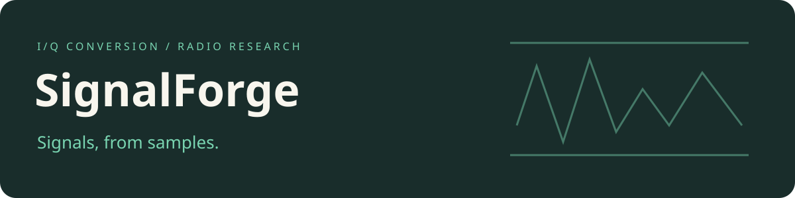

# SignalForge

**Development history:** Developed locally using Git before publication. These projects were published to GitHub together, so similar upload dates do not indicate when development began.

Signal-generation research sources, offline I/Q conversion and platform-specific software-radio experiments.

## Source map

| Path | Purpose |
| --- | --- |
| `offline-noise-sdr/generate/rf-pwm.py` | Convert stored I/Q samples to RF-PWM timing files |
| `offline-noise-sdr/transmit/` | Platform-specific timing-file implementation |
| `fldigi-noise-sdr/` | Modem integration and platform-specific implementation |
| `gnuradio/` | GNU Radio flowgraphs |
| `gnss/` | Existing satellite-navigation research fixtures and scripts |
| `scripts/` | Plotting and stored-data analysis |
| `configs/` | Application configuration examples |

I/Q stores the two components of a complex signal. RF-PWM represents a radio waveform as pulse timings. Existing filenames, commands, binary layouts, rates and platform options retain their established meanings.

## Build environment

The Makefiles select architecture with `ARCH` and operation with `OP`. Their existing defaults and target names are unchanged. The sources target Linux/Windows x86, Android ARM and OpenWrt MIPS toolchains; this macOS checkout does not provide a matching cross-compilation environment.

Use the existing [offline Makefile](offline-noise-sdr/transmit/Makefile), [modem Makefile](fldigi-noise-sdr/Makefile) and [environment provisioning reference](vagrant/bootstrap.sh) to inspect requirements. Provisioning scripts are not part of the publication checks.

[Preservation and verification](COMPATIBILITY.md) documents offline source checks. No RF transmission, acquisition or connected-device activity was performed. Bundled component terms remain in [third-party notices](THIRD_PARTY_NOTICES.md).

## Source terms

The combined source retains its [GPL terms](LICENSE) and separate component notices. New presentation and documentation are available under [MIT](LICENSE-MIT); see [scope](COPYRIGHT).
